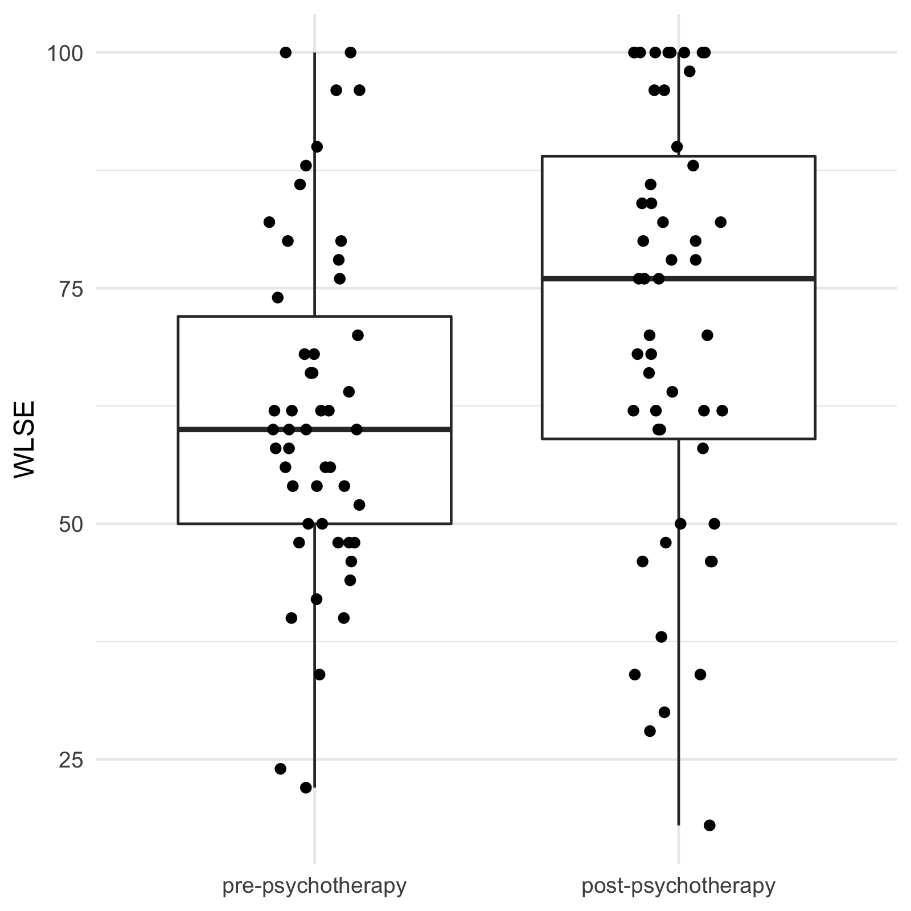

# Paired Samples *t* Tests {#pst}

Last lab covered one sample *t* tests. We learned that one sample *t* tests compare the mean to a specific value. One common use case for this is when pairs of scores can be represented using a single value. For example, imagine you want to test whether cognitive behavioural therapy (CBT) reduces generalized anxiety. Study participants could complete the GAD-7 (a popular measure of generalized anxiety) prior to receiving treatment. Then, after receiving CBT, they could be take the GAD-7 again. The resulting data would be two GAD-7 scores for each participant. If we want to know whether a participant's anxiety decreased, increased, or stayed the same, we could just subtract their pre-treatment score from their post-treatment score. Doing this for each participant yields a single variable that represents the difference (or change) from pre- to post-treatment. We could then conduct a one sample *t* test on the change scores.

Another name for this procedure is a paired samples *t* test. It is so named because the data are two samples that are *paired*. In the example above, samples are paired because they come from the same participant measured on two occasions. This is likely the most common design that leads to paired samples. However, pairs of observations can also come from different individuals. For example, if you wanted to know whether birth influences language acquisition, you could compare the number of words a firstborn child knew at 12 months to the number of words a second born child from the same family knew at 12 months. In this case observations are paired because they come from the same family.

If you are wondering whether a paired samples *t* test is appropriate for your research design, ask yourself whether it makes sense to produce difference scores for your cases. Note that difference scores are not valid when pairs of observations are measured in different metrics. If a pre-to-post design (such as in the CBT example above) uses a different measurement instrument at each measurement occasion (even if both instruments are intended to measure the same construct), difference scores are no longer valid. Another situation when difference scores won't work is when groups of observations are dependent, but not paired. For example, if the CBT study above included participants from several different therapists. Participants with the same therapist would be expected to be more similar to one another than to participants from different therapists. But a paired samples *t* test could not be used to compare them because each participant is not matched to a single other participant.

Because paired samples *t* tests are so similar (mathematically identical, even!) to one sample *t* tests, this lab will give you an opportunity to polish the skills you have already learned. It will also introduce to the important considerations that are unique to paired samples.

## Learning Objectives {#pst-learning-objectives}

After completing this lab, you should be able to do the following using R:

* Conduct paired samples *t* tests.
* Compute Cohen's *d*~z~ for paired samples.
* Create appropriate visualizations for comparisons of two paired samples.

Additionally, you should be able to:

* Explain how paired samples *t* tests are similar (and distinct) from one sample *t* tests.
* Evaluate the assumptions of paired samples *t* tests.
* Accurately interpret the results of paired samples *t* tests.
* Report the results of paired samples *t* tests in APA style.

## The Study: Weight-Loss-Related Self-Efficacy {#pst-study}

### Study Information

#### Description

Weight-loss interventions aim to support people in changing their behaviours to be healthier. This includes promoting healthy-eating and exercise. Self-efficacy is thought to be important for adopting and maintaining such behaviours. That is, people will change their behaviours if they believe they can maintain those behaviours and if they believe that changing their behaviour will help them lose weight.

Because self-efficacy is so important to the success of weight-loss interventions, some such interventions now include psychotherapy specifically aimed at improving self-efficacy. Weight-loss interventions provide instrumental support in helping participants develop a plan for eating healthful foods and engaging in regular physical activity. This has a clear and obvious benefit for self-efficacy. The current study will examine how subsequent psychotherapy further boosts self-efficacy.

#### Hypothesis

The primary hypothesis is that adding psychotherapy to a weight-loss intervention will lead to increased weight-loss self-efficacy.

### Design Plan

#### Study Design

This study will use a within-subjects (paired) design. Participants will be enrolled in a weight-loss intervention at UBCO. They will attend a group session where they are provided general information about healthy eating, and physical activity. They will then have one-on-one interviews with a nutritionist to help them build meal plans that fit their budgets and lifestyles. Following the interviews, the nutritionist will ask participants to complete measures of weight-loss self-efficacy (WLSE). Participants will then meet with a trained psychotherapist who will work with the participants to identify potential barriers to their success and develop strategies for overcoming those barriers. After psychotherapy, participants will be asked to complete the same measure of WLSE.

#### Measures

Weight-loss-related behaviour self-efficacy will be measured using the scale proposed by @wlse. This scale has four items, measured on an 11-point scale ranging from 0% (*Not at All Confident*) to 100% (*Completely Confident*). The scale is relatively new; however, it has demonstrated strong psychometric properties in a large sample drawn from a population that is similar to the population used in the current study [@wlse].

#### Analytic Strategy

We will conduct a directional paired samples *t* test of the null hypothesis that average change in WLSE in the population is equal to zero. Significance will be based on the traditional &alpha; = .05.

#### Sample Size and Power Analysis

We want to be able to detect a difference of 10 points on the WLSE measure. This measure had a *SD* = 21.44 in a large sample from a similar population [@wlse]. Assuming the same *SD* in our sample, a 10-point change translates to Cohen's *d*~z~ = 0.47. To achieve 95% power with a population effect of that size requires a sample of *N* = 50.4. We are therefore aiming for a sample of *N* = 51.

## Data Collection {#pst-data}

<form>
  <!-- 
How confident are you that you can stick with **eating healthful foods...**
 -->
  <!-- <table> -->
  <!--   <tr> -->
  <!--     <td> -->
  <!--       <label for="hese_1">...even if you need a long time to develop the necessary routines?</label> -->
  <!--     </td> -->
  <!--     <td> -->
  <!--       <select id="hese_1" name="hese_1"> -->
  <!--         <option value="NA">(Select an Option)</option> -->
  <!--         <option value="0">0% (Not at all Confident)</option> -->
  <!--         <option value="10">10%</option> -->
  <!--         <option value="20">20%</option> -->
  <!--         <option value="30">30%</option> -->
  <!--         <option value="40">40%</option> -->
  <!--         <option value="50">50%</option> -->
  <!--         <option value="60">60%</option> -->
  <!--         <option value="70">70%</option> -->
  <!--         <option value="80">80%</option> -->
  <!--         <option value="90">90%</option> -->
  <!--         <option value="100">100% (Completely Confident)</option> -->
  <!--       </select> -->
  <!--     </td> -->
  <!--   </tr> -->
  <!--   <tr> -->
  <!--     <td> -->
  <!--       <label for="hese_2">...even if you have to try several times before it works?</label> -->
  <!--     </td> -->
  <!--     <td> -->
  <!--       <select id="hese_2" name="hese_2"> -->
  <!--         <option value="NA">(Select an Option)</option> -->
  <!--         <option value="0">0% (Not at all Confident)</option> -->
  <!--         <option value="10">10%</option> -->
  <!--         <option value="20">20%</option> -->
  <!--         <option value="30">30%</option> -->
  <!--         <option value="40">40%</option> -->
  <!--         <option value="50">50%</option> -->
  <!--         <option value="60">60%</option> -->
  <!--         <option value="70">70%</option> -->
  <!--         <option value="80">80%</option> -->
  <!--         <option value="90">90%</option> -->
  <!--         <option value="100">100% (Completely Confident)</option> -->
  <!--       </select> -->
  <!--     </td> -->
  <!--   </tr> -->
  <!--   <tr> -->
  <!--     <td> -->
  <!--       <label for="hese_3">...even if you have to rethink your entire way of nutrition?</label> -->
  <!--     </td> -->
  <!--     <td> -->
  <!--       <select id="hese_3" name="hese_3"> -->
  <!--         <option value="NA">(Select an Option)</option> -->
  <!--         <option value="0">0% (Not at all Confident)</option> -->
  <!--         <option value="10">10%</option> -->
  <!--         <option value="20">20%</option> -->
  <!--         <option value="30">30%</option> -->
  <!--         <option value="40">40%</option> -->
  <!--         <option value="50">50%</option> -->
  <!--         <option value="60">60%</option> -->
  <!--         <option value="70">70%</option> -->
  <!--         <option value="80">80%</option> -->
  <!--         <option value="90">90%</option> -->
  <!--         <option value="100">100% (Completely Confident)</option> -->
  <!--       </select> -->
  <!--     </td> -->
  <!--   </tr> -->
  <!--   <tr> -->
  <!--     <td> -->
  <!--       <label for="hese_4">...even if you have to make a detailed plan?</label> -->
  <!--     </td> -->
  <!--     <td> -->
  <!--       <select id="hese_4" name="hese_4"> -->
  <!--         <option value="NA">(Select an Option)</option> -->
  <!--         <option value="0">0% (Not at all Confident)</option> -->
  <!--         <option value="10">10%</option> -->
  <!--         <option value="20">20%</option> -->
  <!--         <option value="30">30%</option> -->
  <!--         <option value="40">40%</option> -->
  <!--         <option value="50">50%</option> -->
  <!--         <option value="60">60%</option> -->
  <!--         <option value="70">70%</option> -->
  <!--         <option value="80">80%</option> -->
  <!--         <option value="90">90%</option> -->
  <!--         <option value="100">100% (Completely Confident)</option> -->
  <!--       </select> -->
  <!--     </td> -->
  <!--   </tr> -->
  <!-- </table> -->

  <!-- 
How confident are you that you can be **physically active...**
 -->
  <!-- <table> -->
  <!--   <tr> -->
  <!--     <td> -->
  <!--       <label for="pase_1">...even if you need a long time to develop the necessary routines?</label> -->
  <!--     </td> -->
  <!--     <td> -->
  <!--       <select id="pase_1" name="pase_1"> -->
  <!--         <option value="NA">(Select an Option)</option> -->
  <!--         <option value="0">0% (Not at all Confident)</option> -->
  <!--         <option value="10">10%</option> -->
  <!--         <option value="20">20%</option> -->
  <!--         <option value="30">30%</option> -->
  <!--         <option value="40">40%</option> -->
  <!--         <option value="50">50%</option> -->
  <!--         <option value="60">60%</option> -->
  <!--         <option value="70">70%</option> -->
  <!--         <option value="80">80%</option> -->
  <!--         <option value="90">90%</option> -->
  <!--         <option value="100">100% (Completely Confident)</option> -->
  <!--       </select> -->
  <!--     </td> -->
  <!--   </tr> -->
  <!--   <tr> -->
  <!--     <td> -->
  <!--       <label for="pase_2">...even if you have to try several times before it works?</label> -->
  <!--     </td> -->
  <!--     <td> -->
  <!--       <select id="pase_2" name="pase_2"> -->
  <!--         <option value="NA">(Select an Option)</option> -->
  <!--         <option value="0">0% (Not at all Confident)</option> -->
  <!--         <option value="10">10%</option> -->
  <!--         <option value="20">20%</option> -->
  <!--         <option value="30">30%</option> -->
  <!--         <option value="40">40%</option> -->
  <!--         <option value="50">50%</option> -->
  <!--         <option value="60">60%</option> -->
  <!--         <option value="70">70%</option> -->
  <!--         <option value="80">80%</option> -->
  <!--         <option value="90">90%</option> -->
  <!--         <option value="100">100% (Completely Confident)</option> -->
  <!--       </select> -->
  <!--     </td> -->
  <!--   </tr> -->
  <!--   <tr> -->
  <!--     <td> -->
  <!--       <label for="pase_3">...even if you have to rethink your entire way of physical activity?</label> -->
  <!--     </td> -->
  <!--     <td> -->
  <!--       <select id="pase_3" name="pase_3"> -->
  <!--         <option value="NA">(Select an Option)</option> -->
  <!--         <option value="0">0% (Not at all Confident)</option> -->
  <!--         <option value="10">10%</option> -->
  <!--         <option value="20">20%</option> -->
  <!--         <option value="30">30%</option> -->
  <!--         <option value="40">40%</option> -->
  <!--         <option value="50">50%</option> -->
  <!--         <option value="60">60%</option> -->
  <!--         <option value="70">70%</option> -->
  <!--         <option value="80">80%</option> -->
  <!--         <option value="90">90%</option> -->
  <!--         <option value="100">100% (Completely Confident)</option> -->
  <!--       </select> -->
  <!--     </td> -->
  <!--   </tr> -->
  <!--   <tr> -->
  <!--     <td> -->
  <!--       <label for="pase_4">...even if you have to make a detailed plan?</label> -->
  <!--     </td> -->
  <!--     <td> -->
  <!--       <select id="pase_4" name="pase_4"> -->
  <!--         <option value="NA">(Select an Option)</option> -->
  <!--         <option value="0">0% (Not at all Confident)</option> -->
  <!--         <option value="10">10%</option> -->
  <!--         <option value="20">20%</option> -->
  <!--         <option value="30">30%</option> -->
  <!--         <option value="40">40%</option> -->
  <!--         <option value="50">50%</option> -->
  <!--         <option value="60">60%</option> -->
  <!--         <option value="70">70%</option> -->
  <!--         <option value="80">80%</option> -->
  <!--         <option value="90">90%</option> -->
  <!--         <option value="100">100% (Completely Confident)</option> -->
  <!--       </select> -->
  <!--     </td> -->
  <!--   </tr> -->
  <!-- </table> -->

  
How confident are you that you can **lose weight...**

  <table>
    <tr>
      <td>
        <label for="wlse_1">...even if you need a long time to develop the necessary routines?</label>
      </td>
      <td>
        <select id="wlse_1" name="wlse_1">
          <option value="NA">(Select an Option)</option>
          <option value="0">0% (Not at all Confident)</option>
          <option value="10">10%</option>
          <option value="20">20%</option>
          <option value="30">30%</option>
          <option value="40">40%</option>
          <option value="50">50%</option>
          <option value="60">60%</option>
          <option value="70">70%</option>
          <option value="80">80%</option>
          <option value="90">90%</option>
          <option value="100">100% (Completely Confident)</option>
        </select>
      </td>
    </tr>
    <tr>
      <td>
        <label for="wlse_2">...even if you have to try several times before it works?</label>
      </td>
      <td>
        <select id="wlse_2" name="wlse_2">
          <option value="NA">(Select an Option)</option>
          <option value="0">0% (Not at all Confident)</option>
          <option value="10">10%</option>
          <option value="20">20%</option>
          <option value="30">30%</option>
          <option value="40">40%</option>
          <option value="50">50%</option>
          <option value="60">60%</option>
          <option value="70">70%</option>
          <option value="80">80%</option>
          <option value="90">90%</option>
          <option value="100">100% (Completely Confident)</option>
        </select>
      </td>
    </tr>
    <tr>
      <td>
        <label for="wlse_3">...even if you have to rethink your entire way of losing weight?</label>
      </td>
      <td>
        <select id="wlse_3" name="wlse_3">
          <option value="NA">(Select an Option)</option>
          <option value="0">0% (Not at all Confident)</option>
          <option value="10">10%</option>
          <option value="20">20%</option>
          <option value="30">30%</option>
          <option value="40">40%</option>
          <option value="50">50%</option>
          <option value="60">60%</option>
          <option value="70">70%</option>
          <option value="80">80%</option>
          <option value="90">90%</option>
          <option value="100">100% (Completely Confident)</option>
        </select>
      </td>
    </tr>
    <tr>
      <td>
        <label for="wlse_4">...even if you have to make a detailed plan?</label>
      </td>
      <td>
        <select id="wlse_4" name="wlse_4">
          <option value="NA">(Select an Option)</option>
          <option value="0">0% (Not at all Confident)</option>
          <option value="10">10%</option>
          <option value="20">20%</option>
          <option value="30">30%</option>
          <option value="40">40%</option>
          <option value="50">50%</option>
          <option value="60">60%</option>
          <option value="70">70%</option>
          <option value="80">80%</option>
          <option value="90">90%</option>
          <option value="100">100% (Completely Confident)</option>
        </select>
      </td>
    </tr>
  </table>
</form>

## Assignment Instructions {#pst-assignment}

### R Script

1. Calculate participants' mean scores on the 5-item WLSE measure. Do this separately for the two measurement occasions. See the [additional instructions on scoring][pst-scoring].
1. Calculate *M* and *SD* for the pre- and post-psychotherapy means, and *M*, *SD*, skew, and kurtosis of the difference scores.
1. Use `t.test()` to conduct a paired *t* test of the null hypothesis that average pre-to-post change in WLSE scores is zero.
1. Compute Cohen's *d*~z~ for the change in WLSE scores.
1. Produce a histogram of the WLSE difference scores.
1. Conduct a Shapiro--Wilk test on the difference scores.
1. Produce a boxplot of pre- and post-psychotherapy WLSE scores. See the [additional instructions][pst-plotting] below.

### Additional Instructions {#pst-additional-instructions}

#### Scoring {#pst-scoring}

The "weight-loss.csv" data frame includes item-level data. That is, each column is one item on the WLSE measure. Use `rowMeans()` to calculate each participant's average score on the 5-item measure. Do this separately for the time 1 and time 2 measurement occasions. Add participants' mean scores on times 1 and 2 as columns to your data frame.

Calculate difference/change scores for each participant. This will be the difference between each participant's average WLSE scores at times 1 and 2. When computing difference scores, it is conventional to subtract initial scores from final scores (i.e., time 2 &minus; time 1). Doing this makes the difference scores more interpretable, as a negative difference score means a decrease, and a positive score means an increase.

#### Descriptive Statistics

Produce the following statistics:

* *M* and *SD* of average WLSE scores at both measurement occasions.
* *M*, *SD*, skew, kurtosis of the difference scores.

#### Paired *t* Test

Use `t.test()` to conduct a directional paired samples *t* test comparing WLSE scores before and after psychotherapy.

Use `t.test()` to conduct a one sample *t* test on the difference scores. What do you notice about the results of this test and the results of the paired *t* test?

#### Cohen's *d*~z~

Calculate Cohen's *d*~z~ either by converting *t* to *d* using `psych::t2d()`, or using the *M* and *SD* of the difference scores in the formula $d_{z} = M/SD$.[^1]

[^1]: Some researchers prefer to report Cohen's *d* for independent samples as an effect size for paired *t* tests, so you may encounter that in the literature. Calculating Cohen's *d* for independent samples is covered in the next lab.

### Plots {#pst-plotting}

This section will guide you through the process of producing a figure like the one below.

This is a boxplot with individual data points overlaid. It is a very useful plot because it concisely presents a lot of information.

#### Lengthen the Data

The data are currently arrange such that scores at each measurement occasion are placed in their own columns. That is, there are separate columns for time 1 and time 2 scores.

|pid |wlse_m.t1|wlse_m.t2|
|:--:|:-------:|:-------:|
|1   |44       |50       |
|2   |78       |62       |
|3   |96       |84       |

The same data could be arranged with a single column for each item, and an additional column indicating whether the responses are for time 1 or time 2. That is, instead of time 1 and time 2 responses being differentiated by column, they are differentiated by row.

|pid |name     |value|
|:--:|:-------:|:---:|
|1   |wlse_m.t1|44   |
|1   |wlse_m.t2|50   |
|2   |wlse_m.t1|78   |
|2   |wlse_m.t2|62   |
|3   |wlse_m.t1|96   |
|3   |wlse_m.t2|84   |

Neither of these two options are strictly better than the other. The way the data should be arranged depends on what you are doing with the data. The wider format we have used so far has made sense for what we have been doing. For example, think about how difficult it would be to calculate changer scores if the data were arranged in this longer format.

That said, the plot we want to produce has time on the x axis, and scores on the y axis. To create this plot, time needs its own column in the data frame. So, even though the wider format has made sense so far, we'll need to pivot to the longer format in order to make the plot.

There are many options for reshaping data frames. The easiest (and it isn't close) is to use `tidyr::pivot_longer()` and `tidyr::pivot_wider()`. For a detailed introduction to these functions, see [Chapter 12 of R for Data Science](https://r4ds.had.co.nz/tidy-data.html).

`tidyr::pivot_longer()` has many arguments, but most are optional. You can lengthen your data frame using just the first two arguments: `data` and `cols`. The first argument, `data`, is the data frame you want to lengthen. The second argument, `cols`, is the names of the variables in that data frame that should be pivoted into the longer format.

Two optional arguments you may find useful are `names_to` and `values_to`. These can be used to specify the names of the new columns in the longer data frame. For example, I've renamed my name column "time," and my value column "wlse."

|pid |time     |wlse |
|:--:|:-------:|:---:|
|1   |wlse_m.t1|44   |
|1   |wlse_m.t2|50   |
|2   |wlse_m.t1|78   |
|2   |wlse_m.t2|62   |
|3   |wlse_m.t1|96   |
|3   |wlse_m.t2|84   |

You'll notice that the pivoted data frame looks different than the data frames you have seen thus far. It prints `#A tibble:` and the number of rows and columns. It also gives the data types of the columns in the data frame. That's because the output of `tidyr::pivot_longer()` (and the related function `tidyr::pivot_wider()`) is not a `data.frame`, but a `tibble`. A `tibble` is a variant of a `data.frame` and functions in much the same way. For more information on tibbles, see [Chapter 10 of R for Data Science](https://r4ds.had.co.nz/tibbles.html). If you want to turn your `tibble` back into a `data.frame`, use `as.data.frame()`.

Let's turn our attention to the `time` column. This is a character vector. That means that the values in `time` are unordered. But the values represent an ordered variable (i.e., t1 comes before t2). Also, the values are kind of ugly. In the next step, we'll be plotting these values, and we don't want these ugly names showing up as labels on our plots. We can solve both these problems by converting this character vector to a factor using `factor()`.

|pid |time              |wlse |
|:--:|:----------------:|:---:|
|1   |pre-psychotherapy |44   |
|1   |post-psychotherapy|50   |
|2   |pre-psychotherapy |78   |
|2   |post-psychotherapy|62   |
|3   |pre-psychotherapy |96   |
|3   |post-psychotherapy|84   |

#### Produce the Plot

With the data frame lengthened, you are now ready to produce the boxplot.
